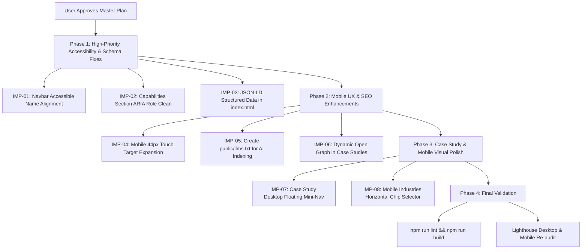

# SS STUDIO — MASTER IMPROVEMENT PLAN (UPDATED)

**Generated Date**: 2026-09-21  
**Status**: **PROPOSAL READY — PENDING USER APPROVAL**  
**Audit Coverage**: Technical SEO, Automated A11y, Multi-Viewport QA + Human-Centric Visual UX & Content Clarity Review  

> [!IMPORTANT]
> **NO MODIFICATIONS HAVE BEEN IMPLEMENTED YET.**  
> This master improvement plan synthesizes all technical, visual, information density, and content clarity findings into an actionable, prioritized roadmap. We are awaiting your explicit approval before applying any code changes.

---

## 1. Master Issue Prioritization Matrix

| Priority | ID | Category | Component / File | Problem & Evidence | Why It Matters to UX & Conversion | Recommended Implementation |
| :--- | :--- | :--- | :--- | :--- | :--- | :--- |
| **P1** | **IMP-01** | Accessibility | `src/components/navigation/navbar.tsx` | Accessible name mismatch on brand logo anchor (`label-content-name-mismatch`). Visible text: `"SS SS STUDIO DIGITAL STUDIO"`, `aria-label="SS STUDIO Homepage"`. | Eliminates screen reader confusion and aligns with WCAG 2.5.3 (Label in Name). | Update `aria-label` to `"SS STUDIO - Digital Studio Homepage"`. |
| **P1** | **IMP-02** | Accessibility | `src/components/sections/capabilities-section.tsx` | `<article role="listitem">` inside services grid lacks parent `role="list"` wrapper. | Resolves invalid ARIA hierarchy warning in automated assistive trees. | Remove redundant `role="listitem"` on semantic `<article>` cards or wrap container in `role="list"`. |
| **P1** | **IMP-03** | SEO / Schema | `index.html` | Missing JSON-LD Schema.org Structured Data (`Organization`, `ProfessionalService`, `WebSite`). | Unlocks Google Knowledge Graph entity recognition and rich search snippets in SERPs. | Embed structured JSON-LD `<script type="application/ld+json">` declaring studio services, tech stack, and official URLs. |
| **P2** | **IMP-04** | Mobile UX | `src/components/hero/hero-gateway.tsx`, `src/components/work/project-card.tsx` | Touch target height is ~24-28px on small text buttons (`"SCROLL TO EXPLORE"`, `"VIEW CASE STUDY"`). | Satisfies WCAG 2.5.8 (Target Size Minimum &ge; 44px) for effortless mobile tapping. | Add invisible touch target expansion padding (`py-2 -my-2` or `min-h-[44px]`). |
| **P2** | **IMP-05** | AI Search | `public/llms.txt` | Missing LLM indexation file for AI search engines (Perplexity, ChatGPT Search, Claude). | Enables structured discovery and citation by next-generation conversational search engines. | Create `public/llms.txt` documenting SS STUDIO services, philosophy, tech stack, and case study links. |
| **P2** | **IMP-06** | Social Sharing | `src/components/case-study/case-study-page.tsx` | Client-side routing updates `<title>` and description on slug change, but `og:title` and `og:description` remain static. | Ensures rich social previews when sharing direct case study deep-links across WhatsApp, LinkedIn, and email. | Extend the existing `useEffect` in `case-study-page.tsx` to update Open Graph meta tags dynamically. |
| **P2** | **IMP-07** | Case-Study UX | `src/components/case-study/case-study-page.tsx` | Long technical dossiers (10-14 sections) lack quick in-page section jumper on desktop. | Allows prospective clients and technical reviewers to jump directly to Strategy, Engineering, or Deliverables. | Add an optional floating sticky pill index (`01 HERO · 02 OVERVIEW · 05 STRATEGY · 09 ENGINEERING · 12 DELIVERABLES`). |
| **P3** | **IMP-08** | Mobile Visuals | `src/components/sections/industries-section.tsx` | On mobile (<768px), 7 stacked vertical buttons create substantial initial scroll height before the active dossier is reached. | Improves vertical pacing and reduces scroll fatigue on mobile screens. | Add horizontal scrolling pill selector on mobile screens while preserving split layout on desktop. |
| **P3** | **IMP-09** | Visual Polish | `src/components/hero/hero-gateway.tsx` | Spatial 3D zone appears dark during initial WebGL asset bootstrap. | Seamless visual texture on slow mobile networks. | Add subtle geometric background blueprint lines during initial canvas bootstrap. |

---

## 2. Proposed Execution Sequence (Upon Approval)



---

## 3. Detailed Implementation Specifications

### Package 1: Accessibility & Schema (`P1`)
1. **Logo Anchor Accessible Name (`IMP-01`)**:
   - File: `src/components/navigation/navbar.tsx`
   - Update `aria-label` to `"SS STUDIO - Digital Studio Homepage"` to align with visible text.
2. **Services ARIA Hierarchy (`IMP-02`)**:
   - File: `src/components/sections/capabilities-section.tsx`
   - Remove redundant `role="listitem"` on semantic `<article>` cards.
3. **JSON-LD Structured Data (`IMP-03`)**:
   - File: `index.html`
   - Embed schema:
     ```json
     {
       "@context": "https://schema.org",
       "@type": "ProfessionalService",
       "name": "SS STUDIO",
       "url": "https://ss-studio.vercel.app/",
       "logo": "https://ss-studio.vercel.app/assets/images/forge-flow-industrial.jpg",
       "description": "SS STUDIO designs and builds premium websites, digital experiences and AI-powered systems for modern businesses.",
       "address": {
         "@type": "PostalAddress",
         "addressCountry": "IN"
       },
       "sameAs": [
         "https://github.com/shyamshanmugam-s",
         "https://linkedin.com"
       ],
       "serviceType": [
         "Web Architecture & Engineering",
         "Digital Experiences",
         "AI & Web Systems",
         "Design Systems"
       ]
     }
     ```

---

### Package 2: Mobile Touch Targets & SEO Enhancements (`P2`)
1. **Touch Target Expansion (`IMP-04`)**:
   - Files: `src/components/hero/hero-gateway.tsx`, `src/components/work/project-card.tsx`
   - Add `min-h-[44px]` touch padding to secondary text buttons to ensure compliance with WCAG 2.5.8.
2. **AI Search Manifest (`IMP-05`)**:
   - File: `public/llms.txt`
   - Create structured markdown summary of SS STUDIO services, philosophy, tech stack, and case study links.
3. **Dynamic Open Graph Meta Tags (`IMP-06`)**:
   - File: `src/components/case-study/case-study-page.tsx`
   - Update `og:title` and `og:description` property tags dynamically on case study navigation.

---

### Package 3: Case Study & Mobile Visual Polish (`P2` & `P3`)
1. **Case Study Floating Mini-Nav (`IMP-07`)**:
   - File: `src/components/case-study/case-study-page.tsx`
   - Add subtle floating sticky index for rapid jumping between Overview, Strategy, Discovery, Engineering, and Deliverables.
2. **Mobile Industries Horizontal Selector (`IMP-08`)**:
   - File: `src/components/sections/industries-section.tsx`
   - On mobile screens (<768px), display a horizontally scrollable chip bar to reduce initial vertical scroll length before reaching the active panel.

---

## 4. Verification Plan

1. **Automated Validation**:
   - `npm run lint` (`tsc --noEmit`) &rarr; 0 errors.
   - `npm run build` (`tsc && vite build`) &rarr; 0 errors.
2. **Lighthouse Re-Test**:
   - Target Scores: **Accessibility: 100/100**, **Best Practices: 100/100**, **SEO: 100/100**.
3. **Cross-Device Browser Validation**:
   - Re-evaluate all 7 viewports (`360px`, `390px`, `414px`, `768px`, `1024px`, `1280px`, `1440px`) to confirm zero layout shifts and touch target compliance.

---

## 5. Next Steps

> [!IMPORTANT]
> **No code changes have been applied.**  
> Please review this plan. Upon your approval, we will implement these improvements cleanly and run final automated validation.
